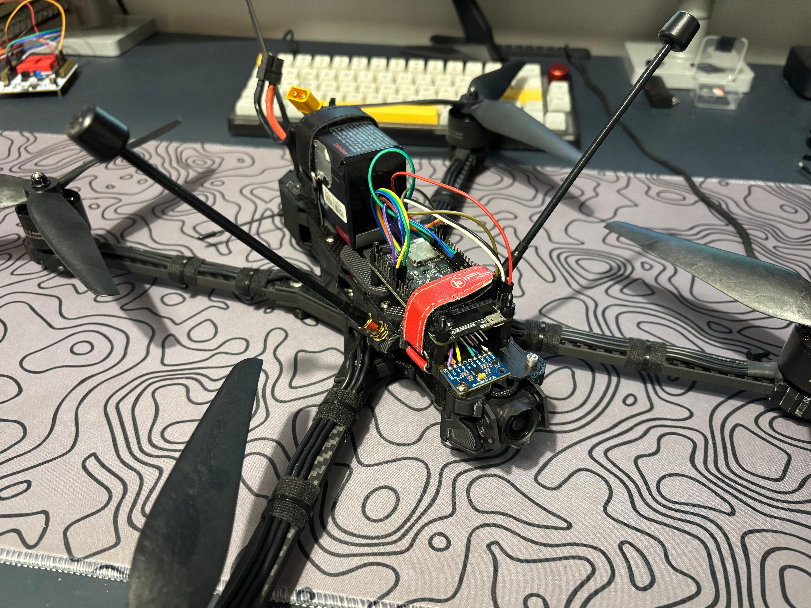
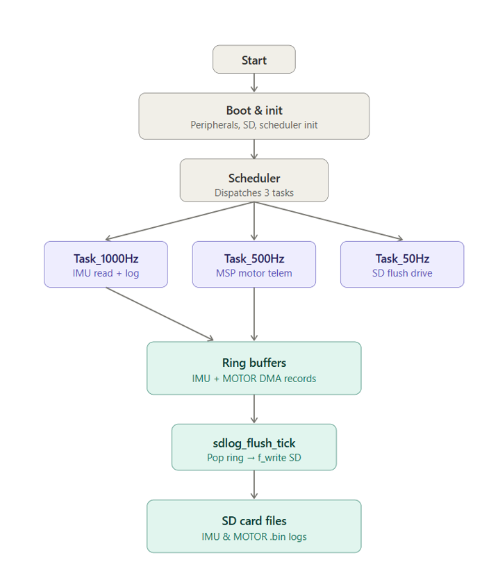
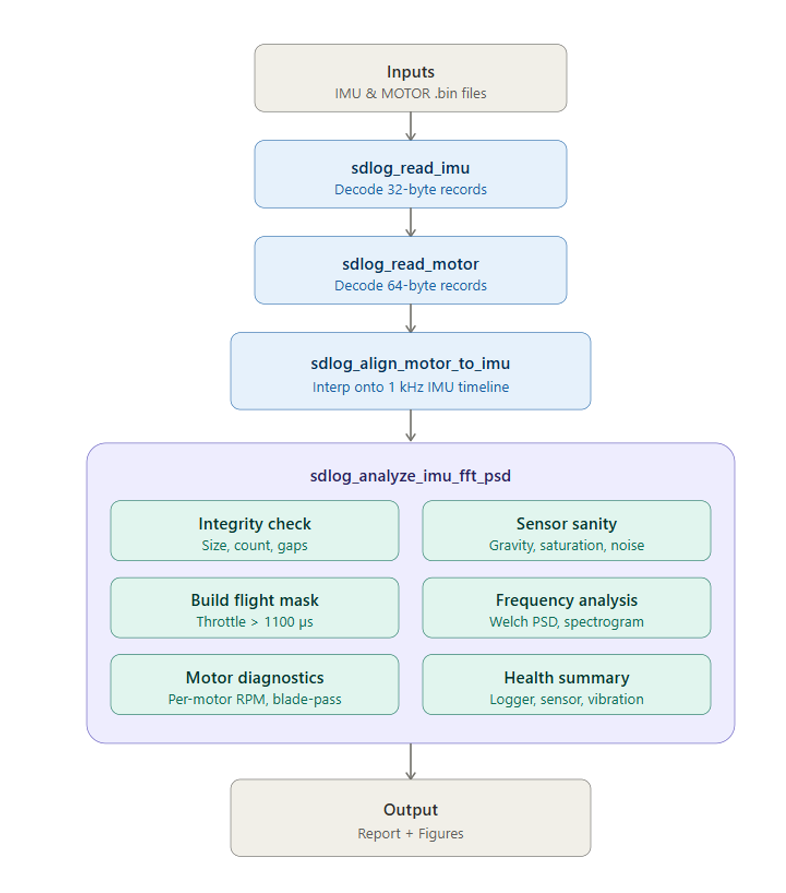
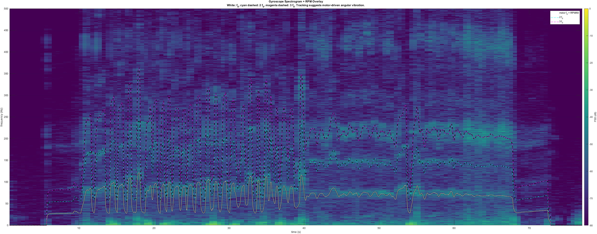
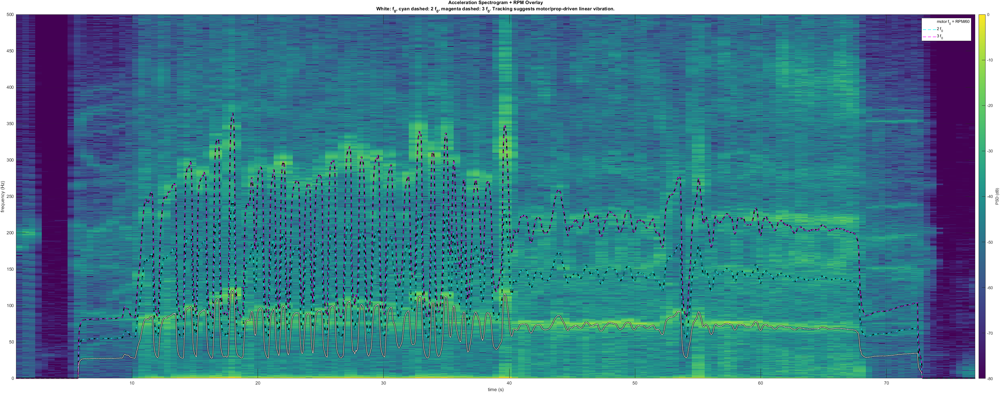
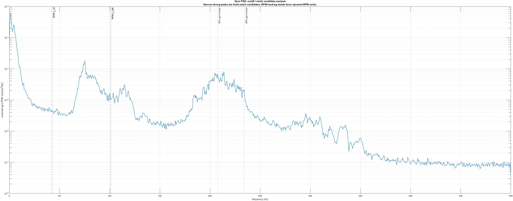
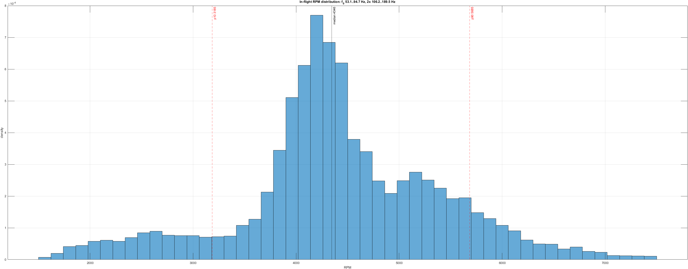

# FFT-Based Vibration and Power Spectral Density Analysis of IMU Data with In-Flight Motor RPM Synchronization on an FPV Drone

End-to-end measurement and analysis pipeline that captures 1 kHz IMU data and concurrent motor RPM telemetry on the same microsecond clock, then quantifies the vibration spectrum using FFT, Welch's power spectral density (PSD), and the short-time Fourier transform — with live motor RPM available as a covariate.

📄 **[Read the Report (PDF)](UAH513E_Report.pdf)**  ·  📊 **[View the Presentation (PDF)](UAH513E_Presentation.pdf)**

<!-- BANNER PLACEHOLDER -->

  
   
  <em>Measurement platform: STM32H743 data logger on an FPV quadcopter with an MPU9250 IMU.</em>

---

## TL;DR

- **1 kHz IMU + 50 Hz motor RPM telemetry**, both binary-logged to SD with a shared microsecond clock — no post-hoc synchronization required.
- **Welch PSD + spectrogram** with live RPM overlay; in-flight masking from the synchronized throttle channel excludes disarmed/idle samples from spectral averaging.
- The **dominant gyroscope vibration tracks motor rotation**, not fixed structural modes — supporting an **RPM-tracking (dynamic) notch** rather than a static one.
- The time-averaged dominant peak (92.3 Hz) corresponds to ~5538 RPM, near the **P90** of the in-flight RPM distribution (5885 RPM), while the **mean RPM** (4425) only predicts 73.8 Hz — an observation consistent with vibration amplitude scaling approximately with RPM².

---

## Project Overview

Multirotor flight controllers close the attitude loop at kilohertz rates using the gyroscope as the direct error input of the inner PID stage. The same IMU also senses every mechanical vibration of the airframe. Motors, propellers, and the frame excite a band whose dominant frequencies move with throttle, so the noise contaminating the control signal is non-stationary and tied to the operating point.

This project began as a single-sensor proposal — log IMU samples, apply FFT and Welch PSD, identify motor- and propeller-driven peaks — and was extended into a synchronized two-sensor system in which the motor state is available alongside the IMU samples. With this addition, spectral peaks gain an attribution rather than only a frequency.

### Research Questions

- **RQ1.** Can synchronized motor telemetry improve the interpretation of IMU vibration spectra by attributing peaks to a known mechanical source?
- **RQ2.** Do dominant vibration peaks track the motor fundamental **f₀ = RPM / 60** and its harmonics, or sit at fixed structural frequencies?
- **RQ3.** Is a static notch sufficient, or is RPM-tracking notch filtering required?

---

## System Architecture

### Hardware

| Component | Role |
|---|---|
| **STM32H743VIT6** (Cortex-M7, 480 MHz) | Data logger and host |
| **MPU9250** (9-axis IMU, SPI) | Accelerometer + gyroscope at 1 kHz |
| **FPV flight controller** | Provides per-motor RPM telemetry at 50 Hz over UART |
| **microSD card** | Persistent binary storage |

### Firmware Data Flow

<!-- DRAWIO PLACEHOLDER 1 -->

  
   
  <em>End-to-end firmware pipeline. Cooperative scheduler runs Task_1000Hz (IMU SPI read + log), Task_500Hz (motor telemetry parser + record build), and Task_50Hz (bounded SD flush).</em>

**Key implementation choices**

- **Shared microsecond clock.** Both IMU and motor records are timestamped by a software-extended 64-bit counter driven by the DWT hardware cycle counter, so the two streams are aligned without any post-hoc synchronization.
- **Log-first / ReadTick-second ordering** in `Task_1000Hz` guarantees that no completed SPI sample is dropped between the SPI completion callback and persistence in the ring buffer.
- **Ring buffers in non-cacheable AXI SRAM** (MPU Region 0) so DMA writes do not need explicit cache maintenance.
- **`Task_50Hz` SD flush bounded to 4 KB per tick** to avoid blocking the higher-rate tasks.

### MATLAB Analysis Pipeline

<!-- DRAWIO PLACEHOLDER 2 -->

  
   
  <em>Per-log MATLAB pipeline: binary loaders → integrity check → motor-to-IMU alignment with smart zero-fill → flight-only PSD masking → Welch / spectrogram / harmonic classification → health summary.</em>

The MATLAB toolchain interpolates the 50 Hz motor record onto the 1 kHz IMU timeline, builds a Boolean in-flight mask from the synchronized throttle channel (samples where any motor's commanded throttle exceeds 1100 µs), and applies Welch PSD and the short-time Fourier transform on the masked signal. Detected peaks are classified against the motor fundamental and its harmonics with a ±8 % tolerance.

---

## Key Results

### Gyroscope spectrogram with live RPM overlay

<!-- FIG 2 PLACEHOLDER -->

  
   
  <em>Gyroscope spectrogram with synchronized motor RPM overlay. Solid line: f₀ = RPM/60. Dashed lines: 2f₀ (cyan), 3f₀ (magenta). Hot pixels track the overlay — the dominant vibration is motor-driven.</em>

### Accelerometer spectrogram

<!-- FIG 3 PLACEHOLDER -->

  
   
  <em>Accelerometer spectrogram with the same RPM overlay. The accelerometer view is a mechanical diagnostic (frame resonance, prop imbalance, mount stiffness) rather than a filter-design input.</em>

### Notch candidate analysis

<!-- FIG 4 PLACEHOLDER -->

  
   
  <em>Summed gyroscope PSD with notch-design guides. Dashed verticals: RPM f₀ p5 and p95. Dotted verticals: 95 % and 99 % cumulative gyroscope power. Broad energy inside the RPM band drives a dynamic notch.</em>

### Why the dominant peak is not at the mean RPM

<!-- FIG 5 PLACEHOLDER -->

  
   
  <em>In-flight RPM histogram with P10 (3185 RPM) and P90 (5885 RPM) dashed verticals. The dominant gyroscope frequency converted back to RPM (5538 RPM, 92.3 Hz) falls near the P90 — not at the mean.</em>

### Headline numbers

| Quantity | Value |
|---|---|
| Mean RPM (in-flight, all motors) | 4425 (P10–P90: 3185–5885) |
| Predicted f₀ from mean RPM | 73.8 Hz |
| Median dominant gyro frequency | **92.3 Hz ≈ P90 f₀** |
| 95 % cumulative gyro power frequency | 207.5 Hz |

---

## Methodology Highlights

### Spectral methods

Welch PSD with 1024-sample Hann windows and 50 % overlap gives a frequency bin width of approximately 0.98 Hz at the 1 kHz IMU rate. The STFT used for the spectrograms uses a longer 2048-sample Hann window with 50 % overlap, yielding a temporal resolution of about 2.05 s and a frequency resolution of approximately 0.49 Hz.

$$
\hat{P}(f) = \frac{1}{K}\sum_{k=1}^{K} P_k(f)
\qquad
S(t, f) = \left| \sum_n x[n]\, w[n-t]\, e^{-j 2\pi f n} \right|^2
$$

### In-flight masking

The drone log starts at power-on but the vehicle is armed and flown only after several seconds of setup. Including the disarmed period in a Welch average dilutes the spectrum: long stretches of near-zero data lower the mean motor-band power and bury narrow peaks. A Boolean mask on the IMU timeline, derived from the synchronized throttle channel, is applied to PSD inputs and to vibration-severity scoring. Spectrograms and time-domain traces keep the full timeline for visual context.

### Harmonic classification

For each detected gyro peak the analyzer searches the motor-fundamental harmonics **m · f₀** and the blade-pass harmonics **m · B · f₀** for m = 1, …, 6, where B is the blade count. A peak is labelled motor-driven if it lies within ±8 % of any candidate. The tolerance was chosen empirically to accommodate the spread of motor RPM within each averaging window (±30 % around the mean for this test run).

## License

The written deliverables in this repository are shared for academic reference. Please cite if used.

For questions: **ozdemiri25@itu.edu.tr**
